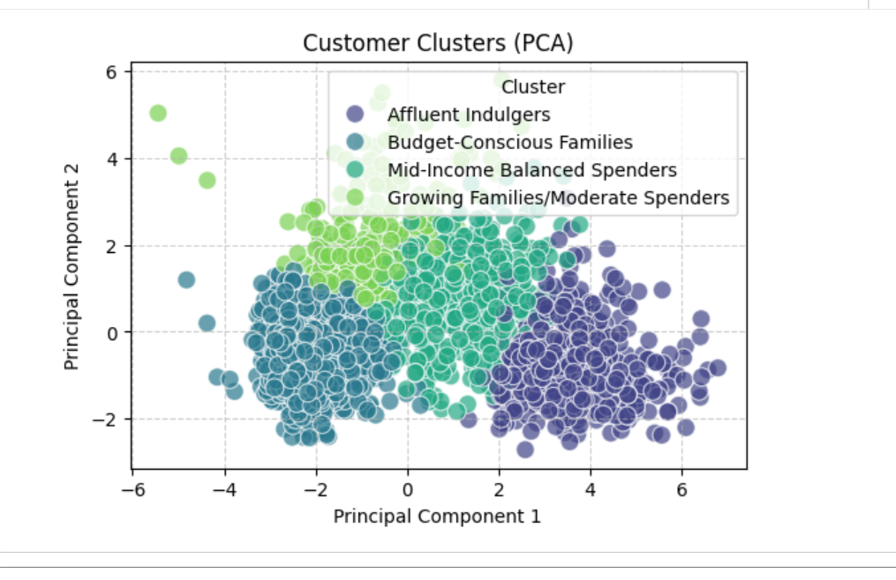
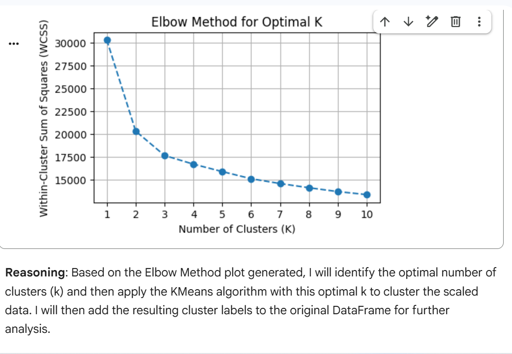
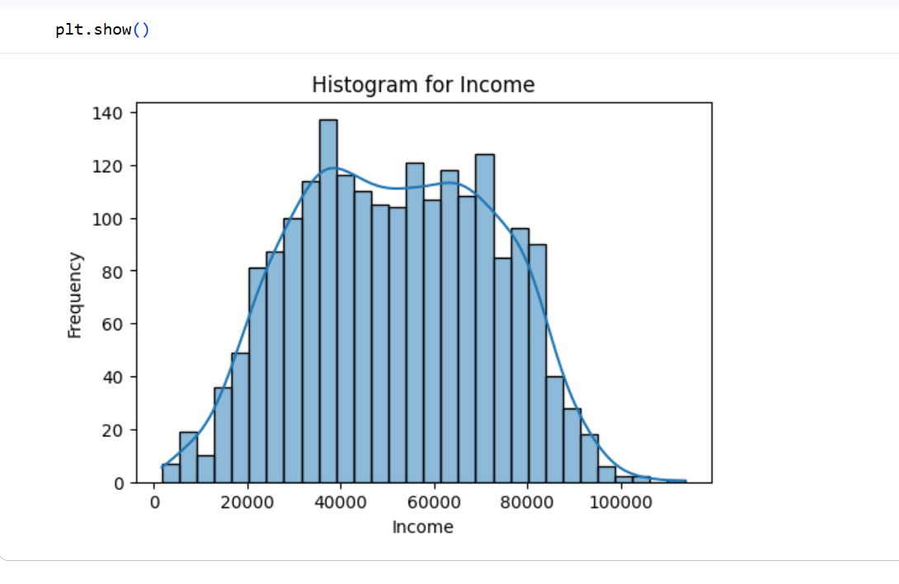

# Customer Segmentation Analysis Using K-Means Clustering
Python data analysis project focusing on performing customer segmentation analysis for an e-commerce company

## 📌 Project Overview

This project focuses on **Customer Segmentation Analysis** using Python and unsupervised machine learning techniques. The goal is to analyze customer demographic data and purchase behavior, then group customers into meaningful segments using **K-Means clustering**.

Customer segmentation helps businesses better understand their customers, personalize marketing strategies, improve customer retention, and increase overall revenue.

---

## 🎯 Project Objectives

The following **Key Concepts and Challenges** were addressed in this project:

* **Data Collection:** Obtain a dataset containing customer information, purchase history, and relevant attributes.
* **Data Exploration and Cleaning:** Explore the dataset, understand its structure, and handle missing or inconsistent data.
* **Descriptive Statistics:** Calculate key metrics such as average purchase value, purchase frequency, and spending patterns.
* **Customer Segmentation:** Utilize clustering algorithms (e.g., K-Means) to segment customers based on behavior and purchase patterns.
* **Visualization:** Create visualizations such as scatter plots and bar charts to illustrate customer segments.
* **Insights and Recommendations:** Analyze characteristics of each segment and provide actionable insights.

### Learning Objectives

* Gain practical experience with clustering algorithms.
* Develop strong data cleaning and exploration skills.
* Learn effective visualization techniques for conveying analytical insights.

---

## 🛠️ Tools and Libraries Used

This analysis was conducted using the following tools and libraries:

* **Python** – Core programming language
* **Pandas** – Data manipulation and preprocessing
* **NumPy** – Numerical computations
* **Matplotlib** – Data visualization
* **Seaborn** – Statistical visualizations
* **Scikit-learn** – K-Means clustering and feature scaling
* **Jupyter Notebook / Google Colab** – Interactive analysis environment

---

## 📂 Dataset Used

* **Dataset Name:** Customer Segmentation Dataset (iFood)
* **File:** `ifood_df.csv`
* **Description:** The dataset contains customer demographic information, purchase behavior, and spending patterns used to segment customers into distinct groups.

> The dataset is loaded locally in the notebook/script. Ensure the file path is correct before running the project.

---

## 🔍 Analysis Summary

The analysis followed these major steps:

1. **Data Exploration:**

   * Inspected dataset structure, data types, and missing values
   * Reviewed distributions of key numerical features

2. **Data Cleaning & Preprocessing:**

   * Handled missing values and inconsistencies
   * Selected relevant features for clustering
   * Scaled numerical features for better clustering performance

3. **Descriptive Statistics:**

   * Calculated average purchase values and customer spending patterns
   * Analyzed purchase frequency and behavioral trends

4. **Customer Segmentation:**

   * Applied the **K-Means clustering algorithm**
   * Determined the optimal number of clusters using methods such as the Elbow Method
   * Assigned customers to distinct segments

5. **Visualization & Interpretation:**

   * Visualized customer segments using scatter plots and bar charts
   * Interpreted behavioral patterns within each cluster

---

## 📊 Sample Visualizations

The project includes visualizations such as:

* **Scatter plots** showing customer clusters
* **Bar charts** comparing average spending across segments
* **Cluster distribution charts**
* 

## 📈 Sample Visualizations

Below are some key visualizations from the analysis:





All other visualizations can be viewed by running the notebook.

---

## ▶️ How to Run the Project

To run this project locally or on Google Colab:

1. **Clone the repository**

   ```bash
   git clone https://github.com/Sanusi-Habeeb-Eniola/customer-segmentation-analysis.git
   ```

2. **Navigate to the project directory**

   ```bash
   cd customer-segmentation-analysis
   ```

3. **Install required dependencies**

   ```bash
   pip install pandas numpy matplotlib seaborn scikit-learn
   ```

4. **Run the analysis**

   * Open the notebook:

     ```bash
     jupyter notebook Customer_Segmentation_Analysis.ipynb
     ```
   * Or run the Python script if available.

5. Ensure `ifood_df.csv` is in the same directory or update the file path accordingly.

---

## 💡 Insights and Recommendations

Based on the customer segments identified:

* High-value customers can be targeted with loyalty and premium offers.
* Price-sensitive segments may respond better to discounts and promotions.
* Personalized marketing strategies can be developed for each customer cluster.
* Customer behavior insights can guide product recommendations and retention strategies.

---

## 👤 Author

**Sanusi Habeeb Eniola**
Data Analytics | Customer Segmentation | Machine Learning | Python

---

⭐ *If you find this project useful, feel free to star the repository and connect!*
